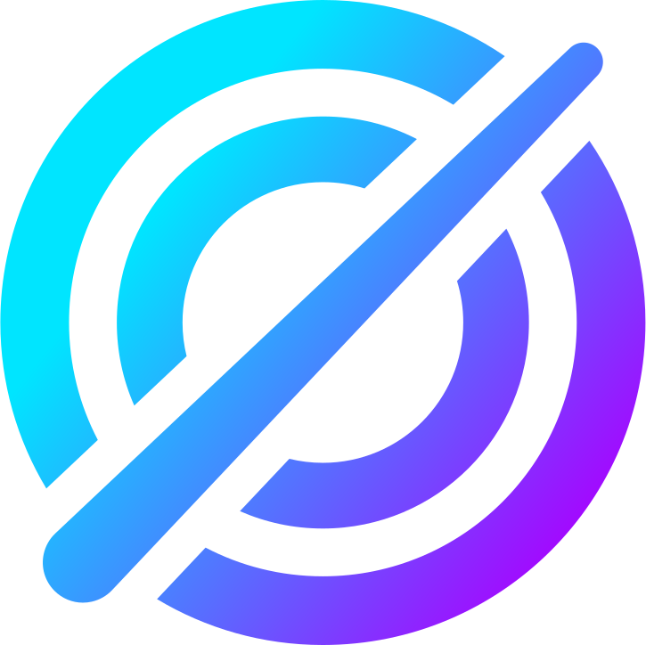

<p align="center">
  
</p>

<h1 align="center">Orchestra MCP</h1>

<p align="center">
  <strong>Turn Claude AI into a 24/7 autonomous company operating system.</strong>
</p>

<p align="center">
  <a href="https://orchestra-mcp.dev">Website</a> &bull;
  <a href="#features">Features</a> &bull;
  <a href="#quick-start">Quick Start</a> &bull;
  <a href="#architecture">Architecture</a> &bull;
  <a href="LICENSE">MIT License</a>
</p>

---

## What is Orchestra MCP?

Orchestra MCP is an MCP (Model Context Protocol) platform that gives Claude AI persistent memory, team coordination, task management, and 91+ tools — turning it into an autonomous operating system for your company.

Connect your Claude Code, Claude Desktop, or Claude.ai to Orchestra and get:

- **Persistent Agent Memory** — agents remember across conversations
- **Team Sync** — multiple agents coordinate on shared projects
- **Task Management** — create, assign, track, and complete tasks
- **Project Boards** — Kanban-style project tracking with gates and reviews
- **Activity Logging** — full audit trail of all agent actions
- **Decision Records** — track architectural and business decisions
- **91+ MCP Tools** — agents, tasks, projects, memory, sessions, skills, workflows, exports, browser control, and more

## Features

### 91+ MCP Tools

Organized across 15 domains: agents, tasks, projects, memory, activity, decisions, sessions, notes, skills, workflows, specs, GitHub integration, notifications, exports, and browser control.

### Self-Hosted Supabase Stack

Full Supabase infrastructure: PostgreSQL, GoTrue auth, PostgREST, Realtime WebSockets, Storage, Edge Functions — all self-hosted via Docker.

### Orchestra Desktop (Tauri)

Native desktop app with:
- Real-time dashboard connected to Supabase
- Markdown editor with GFM support and native file dialogs
- Spotlight command palette (Cmd+K)
- MCP connection manager for Claude Desktop/Code
- macOS liquid glass app icon

### Orchestra Studio (Supabase Fork)

Branded admin panel with:
- User management and authentication
- Database table editor and SQL editor
- Storage, Edge Functions, and Realtime management
- Orchestra-specific pages

### Laravel Web App

Registration, onboarding, billing dashboard with Supabase SDK integration.

## Tech Stack

| Layer | Technology |
|-------|-----------|
| MCP Server | Go 1.26 |
| Web App | Laravel 13 + Livewire + Blade |
| Desktop | Tauri 2.x (Rust + React) |
| Admin Panel | Next.js (Supabase Studio fork) |
| Database | PostgreSQL 18 + pgvector |
| Auth | Supabase GoTrue |
| Realtime | Supabase Realtime (WebSockets) |
| Reverse Proxy | Caddy 2.11 |
| Cache/Queue | Redis |

## Quick Start

### Prerequisites

- Docker & Docker Compose
- Go 1.22+
- PHP 8.4+ & Composer
- Node.js 20+ & pnpm

### Local Development

```bash
# Clone
git clone https://github.com/orchestra-mcp/core.git
cd core

# Start Supabase stack
cd docker && cp .env.example .env && docker compose up -d

# Start Go MCP server
cd ../mcp-server && go run ./cmd/server

# Start Laravel web app
cd ../web && composer install && php artisan serve

# Start Studio
cd .. && pnpm install && pnpm dev:studio
```

### Connect Claude

Add to your `.mcp.json`:

```json
{
  "mcpServers": {
    "orchestra": {
      "type": "streamableHttp",
      "url": "http://localhost:9999/mcp",
      "headers": {
        "Authorization": "Bearer YOUR_MCP_TOKEN"
      }
    }
  }
}
```

## Architecture

```
┌─────────────────────────────────────────────┐
│               Caddy (TLS)                    │
└──────────────────┬──────────────────────────┘
       ┌───────────┼───────────┬──────────────┐
       ↓           ↓           ↓              ↓
   Go MCP      Supabase    Studio      Laravel
   Server      (Kong)      (Next.js)   (PHP-FPM)
   :9999       :8000       :3000       :8000
       └───────────┴───────────┴──────────────┘
                   ↓
            PostgreSQL + Redis
```

## Production Deployment

```bash
# On a fresh Ubuntu 24.04 server
scp deploy/setup.sh root@your-server:/root/
ssh root@your-server "bash /root/setup.sh"

# Deploy
ssh root@your-server "cd /opt/orchestra && bash deploy/deploy.sh"
```

See `deploy/` for full deployment scripts and Caddyfile.

## Project Structure

```
├── mcp-server/          # Go MCP server (91+ tools)
├── web/                 # Laravel web app
├── desktop/             # Tauri desktop app
├── apps/studio/         # Supabase Studio fork
├── docker/              # Supabase Docker Compose
├── deploy/              # Server setup & deploy scripts
├── supabase/migrations/ # Database migrations
├── arts/                # Brand assets
├── spec/                # Product specs & plans
└── .github/workflows/   # CI/CD (test, lint, deploy)
```

## Contributing

1. Create a feature branch from `master`.
2. Make your changes, ensuring tests pass and code follows project conventions.
3. Open a pull request against `master` at `github.com/orchestra-mcp/core`.
4. Update any relevant plan files (check off completed tasks) as part of the PR.

## License

[MIT](LICENSE) &copy; 2026 Orchestra MCP
